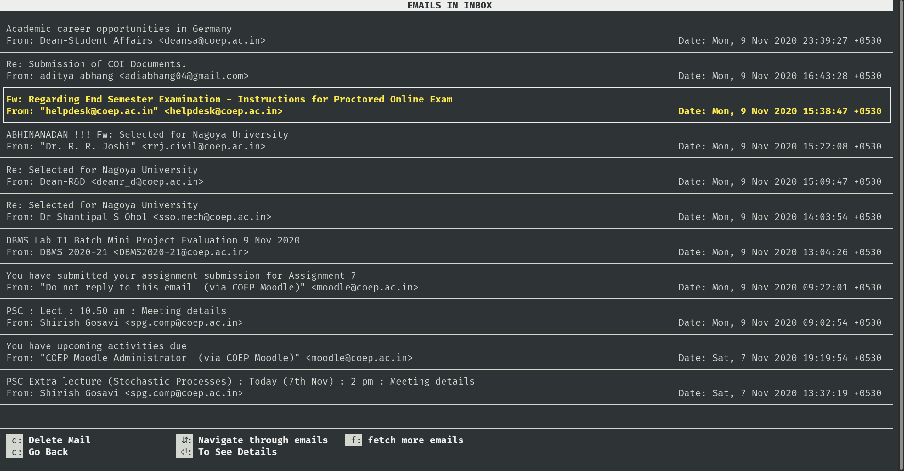

<h1 align="center">
	BashBird
</h1>

<h3 align="center">
  Easy to use terminal based email client.
</h3>

<p align="center">
  

  <a href="https://www.linkedin.com/in/eliasgcf/">
    
  </a>

  
</p>

<p align="center">
  <a href="#-about-the-project">About the project</a>&nbsp;&nbsp;&nbsp;|&nbsp;&nbsp;&nbsp;
  <a href="#-features">Features</a>&nbsp;&nbsp;&nbsp;|&nbsp;&nbsp;&nbsp;
  <a href="#-getting-started">Getting started</a>&nbsp;&nbsp;&nbsp;|&nbsp;&nbsp;&nbsp;
  <a href="#-built-with">Built with</a>&nbsp;&nbsp;&nbsp;|&nbsp;&nbsp;&nbsp;
  <a href="#-acknowledgements">Acknowledgements</a>&nbsp;&nbsp;&nbsp;|&nbsp;&nbsp;&nbsp;
</p>



##  👨🏻‍💻 About The Project
BashBird is a terminal based email client that lets you send and view emails from terminal. The app is written in python3 and uses curses library for frontend and socket programming under the hood to connect IMAP (to receive emails) and SMTP (to send emails) servers. 

## 🌟 Features

-   Complete **terminal** based experience
-   Support for gmail, outlook and coep email account
-   Authenticate securely using SSL and STARTTLS
-   Send emails to multiple recipients.
-   Add multiple attachments (pdf, zip, images supported)
-   Multiple mailboxes
-   View emails by selecting mailbox
-   Delete emails
-   Download email attachments


## 💻 Getting Started

#### Prerequisites:

1. Python3
2. Linux

#### Installing:

1. Install all the required dependencies:
    ```sh
    pip3 install -r requirements.txt
    ```

#### Usage:

1. Start using the app:
    ```sh
    python3 bashbird.py
    ```

#### Instructions:

1. Use the app in maximize window mode for optimal experience
2. [Check that IMAP](https://support.google.com/mail/answer/7126229?hl=en) is enabled for your gmail account
3. Follow login instructions page to login using your gmail account

> The app was tested on python version 3.8 and linux environment

## 🚀 Built With
1. Curses:  terminal handling module for python
2. python3

## 📝 Acknowledgements
1. IMAP: [RFC3501](https://tools.ietf.org/html/rfc3501)
2. SMTP: [RFC821](https://tools.ietf.org/html/rfc821), [RFC2487](https://tools.ietf.org/html/rfc2487), [RFC2554](https://tools.ietf.org/html/rfc2554)
